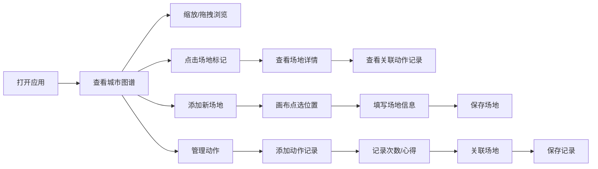

## 1. 产品概述

滑板场地与动作记录应用是一款专为街头滑手设计的本地记录工具，帮助滑手系统记录踩过的场地点位和动作练习进度，通过可视化城市图谱直观展示滑板地图。

- 目标用户：街头滑板爱好者
- 核心价值：将碎片化的场地发现和动作练习沉淀为可回顾的个人滑板地图与成长记录
- 产品定位：纯前端本地应用，数据全部存储在浏览器本地，无需后端服务

## 2. 核心功能

### 2.1 用户角色

| 角色 | 注册方式 | 核心权限 |
|------|----------|----------|
| 滑手 | 无需注册，本地使用 | 管理场地点位、记录动作练习、查看城市图谱 |

### 2.2 功能模块

1. **城市点位图谱**：Canvas 绘制的可缩放可拖拽城市地图，按类型标注场地点位
2. **场地管理**：添加/编辑/删除场地，记录标签、路况、最佳时段等信息
3. **动作记录**：记录每个动作的练习次数、成功与否、练习心得
4. **关联联动**：场地标记关联动作记录，点击场地查看在该地练过的动作

### 2.3 页面详情

| 页面名称 | 模块名称 | 功能描述 |
|----------|----------|----------|
| 主界面 | 城市图谱画布 | 全屏 Canvas 展示场地分布，支持滚轮缩放、拖拽平移、点击标记查看详情 |
| 主界面 | 侧边栏 - 场地列表 | 展示所有场地，支持按类型筛选，点击定位到画布 |
| 主界面 | 侧边栏 - 动作列表 | 展示所有动作及进度，支持按状态筛选 |
| 场地详情弹窗 | 场地信息 | 展示/编辑场地名称、类型、标签、路况描述、最佳时段 |
| 场地详情弹窗 | 关联动作 | 展示在该场地练习过的所有动作记录 |
| 动作详情弹窗 | 动作信息 | 展示/编辑动作名称、难度、总练习次数、成功次数 |
| 动作详情弹窗 | 练习日志 | 按时间线展示每次练习的记录和心得 |
| 添加场地弹窗 | 表单 | 填写场地信息，点击画布选择位置 |
| 添加动作弹窗 | 表单 | 填写动作基本信息，关联场地 |

## 3. 核心流程

### 3.1 主要用户流程

滑手打开应用后，首先看到城市点位图谱。可以通过缩放和拖拽浏览已标记的场地，点击场地标记查看详情和关联的动作记录。也可以通过侧边栏快速浏览和管理场地与动作。

当发现新场地时，滑手点击"添加场地"，在画布上点选位置并填写场地信息。练完动作后，在对应动作下记录练习次数和心得，可关联到特定场地。

### 3.2 流程图

## 4. 界面设计

### 4.1 设计风格

- **整体风格**：街头工业风，深色主题，带有涂鸦和做旧质感
- **主色调**：深灰背景 (#121212)，搭配霓虹橙 (#FF6B35) 和电光蓝 (#00D4FF) 作为点缀
- **辅助色**：荧光绿 (#39FF14) 标记成功动作，警示红 (#FF3366) 标记需继续练习
- **按钮风格**：直角硬朗边框，hover 时有霓虹发光效果
- **字体**：标题使用有冲击力的粗体无衬线字体，正文使用清晰易读的等宽或无衬线字体
- **布局**：左侧侧边栏 + 右侧全屏画布，场地详情采用弹出式面板
- **图标**：简约线条图标，场地类型使用不同几何形状区分（台阶=方形、扶手=线条、碗池=圆形）

### 4.2 页面设计概览

| 页面名称 | 模块名称 | UI 元素 |
|----------|----------|----------|
| 主界面 | 城市图谱画布 | 深色背景、网格线、不同颜色/形状的场地标记、缩放控件 |
| 主界面 | 侧边栏 | 半透明深色面板、标签切换、列表项悬停高亮 |
| 详情弹窗 | 场地/动作详情 | 滑入式面板、标题霓虹色下划线、分段信息卡片 |
| 表单弹窗 | 添加/编辑 | 输入框带底部边框、标签左对齐、保存按钮渐变填充 |

### 4.3 响应式

- 桌面端为主，左侧固定侧边栏 + 右侧画布
- 平板端侧边栏可折叠收起
- 画布交互支持触摸手势（双指缩放、单指拖拽）

### 4.4 Canvas 交互设计

- 画布支持鼠标滚轮缩放（0.5x ~ 5x）
- 按住鼠标左键拖拽平移画布
- 场地标记 hover 时有放大和发光效果
- 点击场地标记弹出详情面板，标记高亮显示
- 添加场地时进入"打点模式"，鼠标变为十字准星
