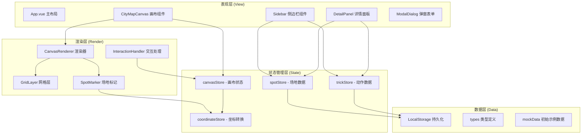
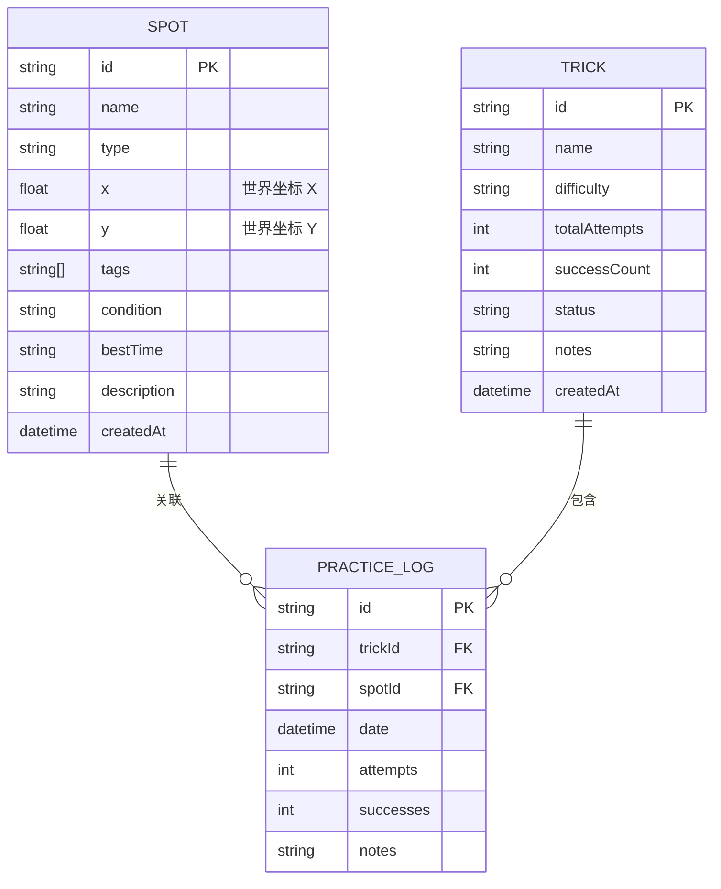

## 1. 架构设计

### 1.1 整体架构



### 1.2 分层原则

**三层隔离架构**：
1. **渲染层 (Canvas)**：只负责绘图，不持有业务数据，通过 props/callbacks 与外部通信
2. **坐标层 (Coordinate)**：独立的坐标转换逻辑，处理屏幕坐标与世界坐标的映射
3. **数据层 (Business)**：Pinia 管理业务数据，与渲染完全解耦

## 2. 技术选型

- **前端框架**：Vue 3 (Composition API) + TypeScript
- **构建工具**：Vite 5
- **状态管理**：Pinia 2
- **样式方案**：SCSS + CSS Variables
- **绘图技术**：原生 Canvas 2D API
- **数据持久化**：localStorage
- **图标**：Lucide Icons

## 3. 目录结构

```
src/
├── components/
│   ├── layout/
│   │   └── AppLayout.vue
│   ├── sidebar/
│   │   ├── Sidebar.vue
│   │   ├── SpotList.vue
│   │   └── TrickList.vue
│   ├── canvas/
│   │   ├── CityMapCanvas.vue
│   │   └── CanvasControls.vue
│   ├── detail/
│   │   ├── SpotDetailPanel.vue
│   │   └── TrickDetailPanel.vue
│   └── modals/
│       ├── AddSpotModal.vue
│       └── AddTrickModal.vue
├── stores/
│   ├── canvas.ts          # 画布视图状态（缩放、平移、视口）
│   ├── coordinate.ts      # 坐标转换工具（独立纯函数）
│   ├── spot.ts            # 场地业务数据
│   └── trick.ts           # 动作业务数据
├── renderers/
│   ├── CanvasRenderer.ts  # 渲染器基类
│   ├── GridRenderer.ts    # 网格背景渲染
│   ├── SpotRenderer.ts    # 场地标记渲染
│   └── types.ts           # 渲染相关类型
├── types/
│   ├── spot.ts            # 场地类型定义
│   ├── trick.ts           # 动作类型定义
│   └── canvas.ts          # 画布相关类型
├── utils/
│   ├── storage.ts         # localStorage 封装
│   └── id.ts              # ID 生成工具
├── mock/
│   └── initialData.ts     # 初始示例数据
├── App.vue
└── main.ts
```

## 4. 路由定义

| 路由 | 用途 |
|------|------|
| / | 主界面（侧边栏 + 画布） |

本应用为单页应用，主要通过弹窗和面板切换视图，不使用多路由。

## 5. 数据模型

### 5.1 ER 图



### 5.2 类型定义

```typescript
// 场地类型
type SpotType = 'stairs' | 'rail' | 'bowl' | 'flat' | 'ramp' | 'other';

interface Spot {
  id: string;
  name: string;
  type: SpotType;
  x: number;  // 世界坐标
  y: number;
  tags: string[];
  condition: string;  // 路况描述
  bestTime: string;   // 最佳时段
  description: string;
  createdAt: number;
}

// 动作类型
type TrickStatus = 'learning' | 'progressing' | 'mastered';
type Difficulty = 'easy' | 'medium' | 'hard' | 'pro';

interface Trick {
  id: string;
  name: string;
  difficulty: Difficulty;
  status: TrickStatus;
  notes: string;
  createdAt: number;
}

// 练习记录
interface PracticeLog {
  id: string;
  trickId: string;
  spotId?: string;  // 可关联场地
  date: number;
  attempts: number;
  successes: number;
  notes: string;
}
```

### 5.3 画布状态模型

```typescript
// 视口状态
interface Viewport {
  zoom: number;       // 缩放比例
  offsetX: number;    // 平移 X
  offsetY: number;    // 平移 Y
}

// 画布尺寸
interface CanvasSize {
  width: number;
  height: number;
}

// 交互状态
interface CanvasInteraction {
  isDragging: boolean;
  isPlacingSpot: boolean;  // 是否处于添加场地打点模式
  hoveredSpotId: string | null;
  selectedSpotId: string | null;
}
```

## 6. 核心模块设计

### 6.1 坐标系统

独立的坐标转换模块，纯函数，不依赖 Vue 响应式：

```typescript
// 屏幕坐标 -> 世界坐标
function screenToWorld(screenX: number, screenY: number, viewport: Viewport): { x: number; y: number }

// 世界坐标 -> 屏幕坐标
function worldToScreen(worldX: number, worldY: number, viewport: Viewport): { x: number; y: number }

// 计算缩放中心点的坐标变换
function zoomAtPoint(screenX: number, screenY: number, oldZoom: number, newZoom: number, offset: { x: number; y: number }): { x: number; y: number }
```

### 6.2 Canvas 渲染器

采用分层渲染设计：
1. **背景层**：深色底 + 网格
2. **标记层**：场地点位（按类型不同形状/颜色）
3. **交互层**：hover 高亮、选中状态、打点模式准星

渲染器接收数据作为参数，不直接引用 store，保持纯净。

### 6.3 Pinia Store 设计

| Store | 职责 | 数据 |
|-------|------|------|
| canvasStore | 画布视图与交互状态 | zoom, offset, dragging, placingMode, selectedSpot |
| spotStore | 场地数据 CRUD | spots 列表 |
| trickStore | 动作与练习记录 | tricks, practiceLogs |

## 7. 本地存储

使用 localStorage 存储所有数据，key 前缀统一管理：

```
skate-app:spots    -> 场地列表
skate-app:tricks   -> 动作列表
skate-app:logs     -> 练习记录
skate-app:canvas   -> 画布视图状态（可选）
```

应用启动时从 localStorage 加载，数据变更时自动持久化。
